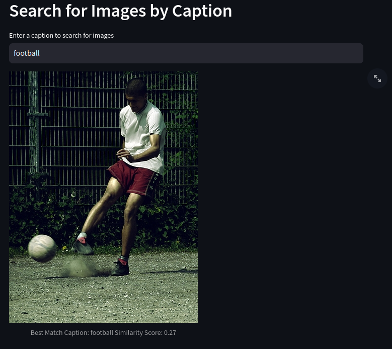
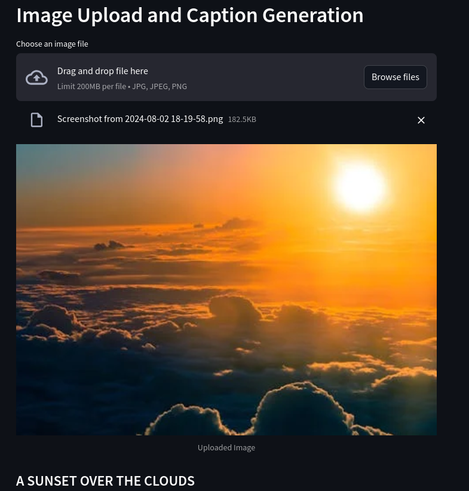

# Image Search and Caption Generation

This application includes the following features:

1. **Search for Images by Caption**: Enter a caption to search for and retrieve the most similar image from a predefined directory.
   

2. **Image Upload and Caption Generation**: Upload an image and receive an automatically generated caption describing its content.
   

---

To run the application, use the following command:
```bash
streamlit run app.py
